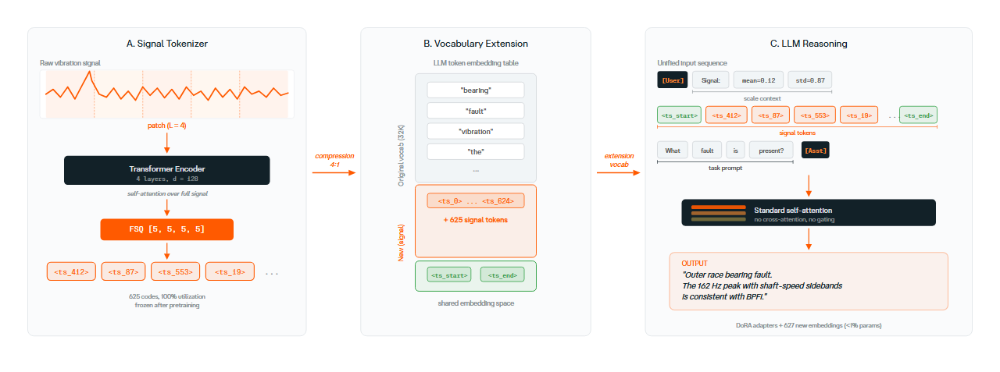

# TEMPO

**Time Series Understanding via Discrete Tokenization.**

[](https://creativecommons.org/licenses/by-nc/4.0/)
[](https://www.python.org/downloads/)
[](https://github.com/astral-sh/ruff)

TEMPO is a backbone-agnostic framework that turns any decoder-only LLM into a
time-series reasoner. Signals are encoded into discrete tokens by a small
FSQ-Transformer quantizer, aligned with the LLM's
embedding space in a Phase-0 pass, and trained to answer questions, classify
patterns in a Phase-1 pass.



---

## Install

```bash
git clone https://github.com/Forgis-Labs/TEMPO.git
cd TEMPO
uv pip install -e .
```

Python ≥ 3.10. Heavy deps (`torch`, `transformers`, `peft`, `accelerate`,
`datasets`, `gradio`) are listed in [pyproject.toml](pyproject.toml).
`uv.lock` pins the exact resolved versions.

---

## Quick Start

### Inference

```python
import tempo

model = tempo.TEMPO.from_pretrained(
    "checkpoints/phase1_best.pt",
    fsq_ckpt="checkpoints/fsq_transformer_rope_625_best.pt",
    llm_id="Qwen/Qwen3-4B",
    use_dora=True,
)

# Free-form analysis
answer = model.analyze(signal, question="Describe the trend in this signal.")
```

### CLI

```bash
python -m tempo \
    --checkpoint checkpoints/phase1_best.pt \
    --fsq_ckpt   checkpoints/fsq_transformer_rope_625_best.pt \
    --signal     data/sample.npy \
    --question   "What is the trend?"
```

### Gradio demo

```bash
uv run --with gradio python scripts/demos/demo_gradio.py \
    --checkpoint   checkpoints/phase1_best.pt \
    --tokenizer-ckpt checkpoints/fsq_transformer_rope_625_best.pt \
    --llm-id Qwen/Qwen3-1.7B
# Open http://localhost:7860
```

---

## Repository Layout

```
tempo/                    Main package
├── model/                TEMPO model + tokenizer adapters
├── tokenizer/            FSQ, FSQ-Transformer, FSQ-Transformer-RoPE, TOTEM
├── data/                 Dataset builders (TSQA, M4 captions, UCR, templates)
├── train/                Phase 0/1 + curriculum trainer, parquet datasets
├── eval/                 Evaluators, scorer, sensitivity, baselines
└── analysis/             Domain-specific probes (ECG, sleep, walking)

scripts/
├── demos/                demo_gradio.py, demo_bearing_qualitative.py
├── data/                 build_pretokenized_parquets.py, explore_dataset.py
├── estimate_training_time.py
└── setup_vm.sh           Lambda Cloud H100 bootstrap

configs/
├── accelerate/           DDP / FSDP / single-GPU launch configs
├── pipeline_4B.yaml      Reference end-to-end Phase 0+1 pipeline (Qwen3-4B)
└── phase1_optimized_8xH100.yaml   Phase 1 on 8×H100 with FSDP

checkpoints/
└── fsq_transformer_rope_625_best.pt   Shipped tokenizer (4096 codes, 4:1 ratio)
```

---

## Architecture

Three components, trained in sequence:

1. **Tokenizer** (small, frozen after pre-training).
   A 1.6 M-parameter encoder/decoder maps a window of normalised real-valued
   samples to a sequence of discrete codes. The shipped tokenizer is
   FSQ-Transformer with `levels = [5,5,5,5]` → **625 codes**, 4:1
   compression. Additional tokenizers explored in [tempo/tokenizer/](tempo/tokenizer/):
   FSQ (CNN encoder), FSQ-Transformer-RoPE, and TOTEM (VQ-VAE).

2. **Phase 0 — Alignment.** The LLM is frozen and only a small projection
   (and optionally a thin LoRA / DoRA adapter) is trained so that the
   tokenizer's code embeddings live in a region of the LLM's input space
   that survives downstream prompting.

3. **Phase 1 — Instruction tuning.** LoRA / DoRA adapters are trained on
   downstream tasks (MCQ, captioning, CoT, classification) with the LLM
   conditioned on `<TS> code1 code2 … codeN </TS>` segments inlined into
   the chat template.


---

## Training pipelines

The package supports two trainer backends, selected via `SHRIKE_TRAINER`
(historical name, kept for backwards-compat):

| Backend           | Driver                                                 | When to use                         |
| ----------------- | ------------------------------------------------------ | ----------------------------------- |
| `v1` (Accelerate) | [tempo/train/trainer.py](tempo/train/trainer.py)       | Fine-grained control, custom loops  |
| `v2` (TRL + DDP)  | [tempo/train/trainer_v2.py](tempo/train/trainer_v2.py) | Default; matches HF SFTTrainer flow |

Both run the same Phase 0 → Phase 1 flow exposed by
[`tempo.train.run_pipeline`](tempo/train/pipeline.py).

```python
from tempo import TEMPO, TEMPOConfig
from tempo.train import run_pipeline, PipelineConfig

model = TEMPO(TEMPOConfig(llm_id="Qwen/Qwen3-4B", lora_r=32, use_dora=True))
run_pipeline(model, PipelineConfig(batch_size=4, grad_accum=4))
```

`PipelineConfig` exposes the schedule (`phase0_epochs`, `phase1_lr`,
`warmup_frac`, packing, gradient checkpointing). Pretokenized parquet
shards are read by the dataset loader in
[tempo/train/parquet_dataset.py](tempo/train/parquet_dataset.py).

To regenerate the parquets from raw HuggingFace + UCR sources, run:

```bash
python scripts/data/build_pretokenized_parquets.py \
    --tokenizer fsq_transformer_rope \
    --tokenizer-ckpt checkpoints/fsq_transformer_rope_625_best.pt \
    --output-dir data/pretokenized
```

## Evaluation

```python
from tempo.eval import evaluate, sensitivity_test

result = evaluate(model, test_dataset, output_dir="results/phase1",
                  dataset_name="har", task="classification")
print(result.accuracy, result.f1_macro)

# Robustness sweep over signal perturbations
sensitivity_test(model, test_dataset)
```

## License

[CC BY-NC 4.0](LICENSE) — free for research and non-commercial use.
For commercial licensing, contact [riccardo.maggioni@forgis.com](mailto:riccardo.maggioni@forgis.com).

## Citation

```bibtex
@misc{forgis2026tempo,
  title  = {TEMPO: Time Series Understanding via Discrete Tokenization},
  author = {Forgis},
  year   = {2026},
  url    = {https://github.com/Forgis-Labs/TEMPO},
}
```
